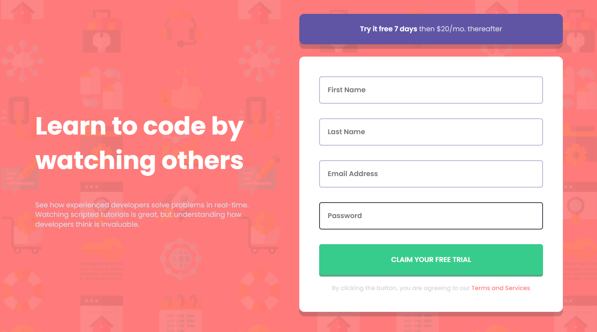

# Frontend Mentor - Intro component with sign up form solution

This is a solution to the [Intro component with sign up form challenge on Frontend Mentor](https://www.frontendmentor.io/challenges/intro-component-with-signup-form-5cf91bd49edda32581d28fd1).

## Table of contents

- [Overview](#overview)
  - [The challenge](#the-challenge)
  - [Screenshot](#screenshot)
  - [Links](#links)
- [My process](#my-process)
  - [Built with](#built-with)
  - [What I learned](#what-i-learned)
  - [Useful resources](#useful-resources)
- [Author](#author)

## Overview

### The challenge

Users should be able to:

- View the optimal layout for the site depending on their device's screen size
- See hover states for all interactive elements on the page
- Receive an error message when the `form` is submitted if:
  - Any `input` field is empty. The message for this error should say _"[Field Name] cannot be empty"_
  - The email address is not formatted correctly (i.e. a correct email address should have this structure: `name@host.tld`). The message for this error should say _"Looks like this is not an email"_

### Screenshot



### Links

- Solution URL: [Browse solution 🌐](https://github.com/VikashMaurya10/intro-component-with-signup-form-master)
- Live Site URL: [view 🌐](https://vikashmaurya10.github.io/intro-component-with-signup-form-master/)

## My process

### Built with

- Semantic HTML5 markup
- SCSS custom properties
- Flexbox
- Mobile-first workflow

### What I learned

During this design coding i learned the more javaScript like client site Form validation with DOM

To see how you can add code snippets, see below:

```js
const engine = (Id, serial, message) => {
  if (Id.value.trim() === "") {
    errorMsg[serial].innerHTML = message;
    errorIcon[serial].style.opacity = "1";
    innerInputContainer[serial].style.border = "2px solid  hsl(0, 100%, 74%)";
    Id.placeholder = " ";
    Email.placeholder = "email@example/com";
    Email.classList.add("placeholder");
  } else {
    errorMsg[serial].innerHTML = "";
    errorIcon[serial].style.opacity = "0";
    innerInputContainer[serial].style.border = "2px solid  hsl(246, 25%, 77%)";
    Email.classList.remove("placeholder");
  }
};
form.addEventListener("submit", (e) => {
  e.preventDefault();
  engine(firstName, 0, "First Name cannot be empty");
  engine(lastName, 1, "Last Name cannot be empty");
  engine(Email, 2, "Look like this is not an email");
  engine(password, 3, "Password can not be empty");
});

const Blur = (id, serial) => {
  id.onblur = () => {
    innerInputContainer[serial].style.border = "2px solid hsl(246, 25%, 77%)";
  };
};
const Focus = (id, serial, placeHolder) => {
  id.onfocus = () => {
    innerInputContainer[serial].style.border = "2px solid   hsl(249, 10%, 26%)";
    errorMsg[serial].innerHTML = "";
    errorIcon[serial].style.opacity = "0";
    id.placeholder = placeHolder;
    id.classList.remove("placeholder");
  };
};
```

### Useful resources

- [Figma](https://www.figma.com) - This helped me for measuring the actual design. I really liked this pattern and will use it going forward.
- [Read article](https://www.freecodecamp.org/news/learn-javascript-form-validation-by-making-a-form/) - This is an amazing article which helped me finally understand how to conduct Form validation with mminimal code. I'd recommend it to anyone still learning this concept.

## Author

- Frontend Mentor - [@vikashmaurya](https://www.frontendmentor.io/profile/VikashMaurya10)
- LinkedIn - [@in-vikashmaurya](https://www.linkedin.com/in/in-vikashmaurya)
